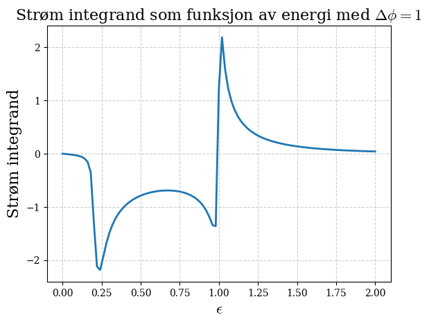

## HTML Version
You can view the HTML version of this notebook:
- **Project Overview:** [index.html](https://endregb.github.io/josephson-effect/) - Interactive landing page with project details
- **Full Simulation:** [joseph-effect-simulation.html](https://endregb.github.io/josephson-effect/joseph-effect-simulation.html) - Complete notebook with all code and results

# Josephson Effect Simulation

This project models the quantum mechanical phenomenon known as the **Josephson effect**, where a **supercurrent** flows between two superconductors separated by a thin normal metal region (a Josephson junction). The effect is mediated by **Cooper pairs** tunneling through the barrier without resistance, governed by a phase difference between the superconductors.

We solve the **Usadel equations** numerically to study how superconducting correlations penetrate into the normal metal and give rise to measurable currents. These equations describe **diffusive superconducting systems** and are widely used in mesoscopic physics.

## Key Results


*Figure 1: Current integrand as a function of energy for different phase differences between the superconductors. The integrand shows how different energy states contribute to the total supercurrent, with positive and negative contributions depending on the phase difference. The area under these curves determines the net current flow through the junction.*


*Figure 2: Current integrand as a function of phase difference between the superconductors. The integrand peaks at $\Delta\varphi = \pi/2$ and approaches zero as the phase difference approaches zero or $\pi$. This behavior is characteristic of the Josephson effect, where the current is maximized when the phase difference is optimal for Cooper pair tunneling.*

---

## Objectives

- Solve **boundary value problems** using shooting methods and built-in solvers
- Simulate **Green functions** and **density of states** in superconducting systems
- Analyze **supercurrents** as a function of energy, phase difference, and geometry
- Understand the emergence of **minigaps** and the **proximity effect**

---

## Methods

- Implemented a **Runge-Kutta method of order 3(2)** with adaptive step size
- Used the **secant method** to solve nonlinear boundary problems
- Represented complex matrices as **real-valued vectors** to solve the Usadel equation
- Solved the Usadel equation using `scipy.integrate.solve_bvp`
- Computed physical observables like **density of states** and **current integrand**

---

## Structure

- All code and analysis are contained in one notebook:
  - `joseph-effect-simulation.ipynb`
- The notebook is organized by task (1a, 1b, ..., 2n) as defined in the original assignment
- All plots are labeled and discussed inline with the code

---

## Academic Context

This project was completed as a group assignment in the course **TMA4320 Introduksjon til vitenskapelige beregninger** at NTNU (Spring 2025).

The assignment is based on *"The Josephson effect"* by Johanne B. Tjernshaugen and aims to provide practical experience in solving boundary value problems and understanding superconductivity.

The notebook is written in **Norwegian**, but this README provides an English overview.

Collaborators:

- [eirikrba](https://github.com/eirikrba)
- [adrianlund2003](https://github.com/adrianlund2003)
- [andrea14](https://github.com/andrea14)

---

## Conclusion

The simulations demonstrate that:

- In symmetric boundary conditions (no phase difference), no net supercurrent flows
- When a phase difference is introduced between the superconductors, a supercurrent emerges, peaking near $\Delta\varphi = \pi/2$
- The **density of states** in the normal region shows a **minigap** due to the **proximity effect**, which shrinks as the length of the normal metal increases

These results align with theoretical predictions and confirm the usefulness of the Usadel equation in modeling mesoscopic superconducting systems.

---

## Requirements

- Python 3.x
- `numpy`
- `scipy`
- `matplotlib`
- `tqdm` (optional)
- `jupyter` (for running the notebook)

Install dependencies with:

```bash
pip install -r requirements.txt
